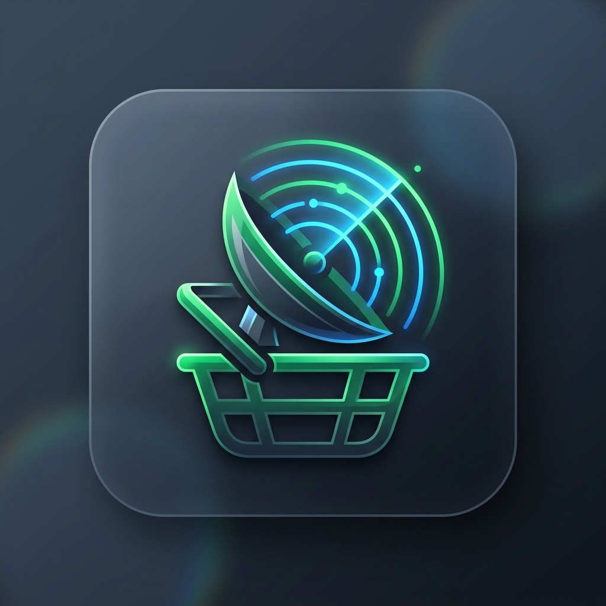

<p align="center">
  
</p>

<h1 align="center">📡 KupiRadar (Česká Republika)</h1>

<p align="center">
  <strong>Ультра-легкий кросс-платформенный радар цен, комбинаторный оптимизатор продуктовой корзины и нутрициологический калькулятор (КБЖУ) для всей Чехии.</strong>
</p>

<p align="center">
  
  
  
  
  
  
</p>

---

> 💡 **Проект независимого разработчика**: KupiRadar полностью спроектирован, разработан и поддерживается одним человеком. В приложении принципиально нет коммерческой рекламы сетей, платных накруток супермаркетов и скрытых трекеров. Если сервис помогает вам экономить семейный бюджет и время в магазинах Чехии, поддержите разработку физического тестирования и инфраструктуры в [Разделе поддержки (Donation Zone)](#-поддержка-автора-и-развития-проекта-donation-zone).

---

## 📑 Содержание

1. [Использованные библиотеки и стек иконок](#-использованные-библиотеки-и-стек-иконок)
2. [Для кого и зачем создан KupiRadar](#-для-кого-и-зачем-создан-kupiradar)
3. [Кросс-платформенная архитектура и устройства](#-кросс-платформенная-архитектура-и-устройства)
4. [Поддержка складных устройств (Foldable & Tabletop Mode)](#-поддержка-складных-устройств-foldable--tabletop-mode)
5. [Функциональные возможности](#-функциональные-возможности)
6. [Языки интерфейса (6 локализаций)](#-языки-интерфейса-6-локализаций)
7. [Офлайн-архитектура (100% Offline-First)](#-офлайн-архитектура-100-offline-first)
8. [Инструкция по установке и сборке](#-инструкция-по-установке-и-сборке)
9. [Автоматизированное тестирование (11 тест-сьютов)](#-автоматизированное-тестирование-11-тест-сьютов)
10. [💖 Поддержка автора и развития проекта (Donation Zone)](#-поддержка-автора-и-развития-проекта-donation-zone)
11. [Лицензия](#-лицензия)

---

## 🧰 Использованные библиотеки и стек иконок

Интерфейс спроектирован с упором на максимальную производительность, мгновенный отклик (120 FPS) и нулевой мусорный оверхед (бандл всего **~89 KB gzip**):

- **Иконки и символы**:
  - `unplugin-icons` + `@iconify-json/lucide` — векторный стек Lucide Icons с компиляцией в нативные Vue-компоненты на этапе сборки. В итоговый бандл попадают **только фактически используемые глифы** без загрузки внешних тяжелых шрифтов.
  - Адаптивные SVG-индикаторы магазинов, сетей и питательных макросов.
- **Frontend Core**:
  - **Vue 3.5** (Composition API, `<script setup>`, глубокая реактивность без виртуального оверхеда).
  - **TypeScript 5.7** (строгая типизация всех моделей, цен, EAN-кодов и нутриентов).
  - **Vite 6** (молниеносный HMR и оптимизированный Rollup-бандлер).
- **Стили и раскладка**:
  - **Tailwind CSS v4** с поддержкой Container Queries и CSS Viewport Segments API (`horizontal-viewport-segments`, `vertical-viewport-segments`).
- **Хранилище данных и PWA**:
  - **Dexie.js 4.0** — реактивная обертка над нативным IndexedDB с транзакциями, составными индексами и локальным хранением каталога.
  - **vite-plugin-pwa** + **Workbox 7** — сервис-воркер с предкэшированием 14 ассетов и runtime-кэшированием внешних изображений (`StaleWhileRevalidate`).
- **Десктоп и Мобильная экосистема**:
  - **Tauri v2** (Rust) — для сверхлегкой сборки десктопного приложения Windows, macOS и Linux.
  - **Capacitor 7** — для сборки нативного Android APK с поддержкой аппаратных сгибов экранов.

---

## 🎯 Для кого и зачем создан KupiRadar

В розничной торговле Чехии покупатель ежедневно сталкивается с непрозрачной картиной:
1. **Разрозненные промо-акции**: скидки распределены по десяткам мобильных приложений сетей (Clubcard, Můj Albert, Lidl Plus, Kaufland Card, BILLA Bonus).
2. **Маркетинговый шринкфлейшн**: визуально банка колы или пачка молока может стоить дешевле, но иметь нестандартный объем (1.5 л vs 2.0 л, 900 г vs 1000 г).
3. **Иллюзия выгоды при поездках**: экономия 15 Kč на продуктах в соседнем супермаркете теряет всякий смысл, если на бензин или билет MHD тратится 20–40 Kč.

**KupiRadar решает эту задачу математически:**
- Сопоставляет реальную удельную стоимость за единицу (`Kč / 1 l`, `Kč / 1 kg`).
- Учитывает клубные карты и регулярные цены.
- Вычисляет, имеет ли смысл разбивать покупку на 2 магазина с учетом стоимости логистики (Friction Cost).
- Считает суммарный баланс КБЖУ и показывает, какие продукты дают максимальное количество белка на каждую потраченную крону.

---

## 📱 Кросс-платформенная архитектура и устройства

KupiRadar создан по принципу **«единый чистый код — идеальный UX на любом экране»**:

| Платформа | Технология | Особенности работы |
| :--- | :--- | :--- |
| **Веб / PWA** | Браузер / PWA Standalone | Установка в 1 клик с экрана браузера, мгновенная загрузка через Service Worker, работа офлайн. |
| **Смартфоны (Android / iOS)** | Capacitor / PWA | Оптимизировано под управление одной рукой, нижняя плавающая навигация, тач-степперы количества. |
| **Складные телефоны (Foldables)** | W3C Device Posture API | Двухэкранный режим при раскрытии (книжка), Tabletop-режим при сгибе на 90° (Galaxy Z Fold, Pixel Fold). |
| **Планшеты (iPad / Android)** | CSS Grid & Master-Detail | Разделение экрана: слева каталог с фильтрами, справа корзина с интерактивным оптимизатором. |
| **Десктоп (Windows, macOS, Linux)** | Tauri v2 (Rust) | Автономное настольное приложение с минимальным потреблением RAM (< 40 MB), интеграцией в трей и горячими клавишами. |

---

## 📐 Поддержка складных устройств (Foldable & Tabletop Mode)

В приложении встроен компонент `FoldableTwoPane.vue`, который отслеживает аппаратное положение устройства:
- **Book Posture (Книжка)**: левая панель отводится под поиск и фильтры, правая — под корзину и оптимизацию сплит-поездок. Зона аппаратного шарнира (hinge crease) программно защищена от наложения кнопок.
- **Tabletop Posture (Ноутбучный сгиб под 90°)**: устройство ставится на стол. Верхний полуэкран превращается в инфо-панель (графики КБЖУ, экономия и рекомендации магазинов), нижний — в удобную рабочую клавиатуру/чекер товаров.
- **Интерактивный симулятор**: В шапке приложения доступен переключатель `Auto / Fold / Tabletop`, позволяющий наглядно протестировать поведение на любом стандартном мониторе.

---

## ⚡ Функциональные возможности

### 1. Каталог и поиск по 13 сетям Чехии
- Поддерживаемые сети: **Tesco, BILLA, Albert, Lidl, Kaufland, Rohlík.cz, Košík.cz, Globus, Tamda Foods, Ratio s.r.o., COOP, JIP Potraviny, ESO MARKET**.
- Точный поиск по названию, брендам, категориям и штрихкодам EAN-13.
- Фильтрация по магазинам, регионам/PSČ и тумблер «Только акции».
- Полная карточка товара с данными о производителе и боттлере (например, завод *Coca-Cola HBC Česko a Slovensko, Českobrodská 1329, Praha 9 - Kyje*).

### 2. Честная цена за единицу (Kč / 1 l, Kč / 1 kg)
- Автоматический пересчет стоимости напитков за 1 литр и весовых товаров за 1 килограмм.
- Цветовая индикация скидок по картам лояльности (Clubcard, BILLA Bonus, Můj Albert).

### 3. Комбинаторный оптимизатор корзины с учетом трения
- Алгоритм выполняется в фоновом потоке **Web Worker** без задержек интерфейса.
- Находит самый выгодный единый супермаркет.
- Просчитывает комбинации сплита на 2 магазина.
- **Параметр стоимости перемещения (Friction Cost)**: настраивается покупателем (0 Kč пешком, 15 Kč билет MHD, 20 Kč/40 Kč бензин). Сплит рекомендуется **только если реальная чистая выгода превышает стоимость дороги**.

### 4. Нутрициологический калькулятор (КБЖУ) и рейтинг белка
- Автоматический расчет суммарной энергии (kcal и kJ), белков, углеводов, жиров и клетчатки на весь набранный чек с учетом фасовок.
- Наглядный сегментированный бар распределения калорий из макронутриентов.
- Пресеты суточных целей:
  - *Vyvážená strava* (2000 kcal, 75g B, 250g U, 65g T).
  - *Fitness & Svaly* (2500 kcal, 160g B, 270g U, 70g T).
  - *Low-Carb / Keto* (1800 kcal, 110g B, 30g U, 130g T).
- **Лидерборд «Cena za bílkoviny»**: ранжирует продукты корзины по минимальной стоимости 1 грамма чистого белка (`Kč / g protein`).

### 5. Избранное и Сравнение
- Сохранение любимых позиций в IndexedDB с отслеживанием динамики цен.
- Модуль сопоставления до 4 товаров бок-о-бок с подсветкой лучшей удельной цены.

### 6. Актуальные буклеты (Akční letáky)
- Раздел каталога цифровых буклетов всех торговых сетей с обратным отсчетом дней действия скидки.

---

## 🌍 Языки интерфейса (6 локализаций)

KupiRadar полностью локализован на 6 европейских языков. Переключение происходит мгновенно без перезагрузки страницы:
- 🇨🇿 **Čeština** (базовый язык системы)
- 🇸🇰 **Slovenčina**
- 🇵🇱 **Polski**
- 🇩🇪 **Deutsch**
- 🇬🇧 **English**
- 🇸🇮 **Slovenščina**

---

## 📴 Офлайн-архитектура (100% Offline-First)

- Все данные каталога, история цен, избранное и корзина хранятся локально в **IndexedDB** браузера/устройства.
- **Workbox Service Worker** предкэширует 14 критических файлов ядра приложения.
- Изображения товаров кэшируются при первом просмотре по стратегии `StaleWhileRevalidate` на 30 дней.
- При отсутствии интернета приложение автоматически выводит статус `Offline (IndexedDB)` и сохраняет полную функциональность поиска, расчетов и корзины.

---

## 🛠 Инструкция по установке и сборке

### Требования
- **Node.js**: версии 20.x или выше
- **npm**: 10.x или выше
- *(Опционально для десктопа)*: Rust и Cargo для сборки Tauri v2
- *(Опционально для Android)*: Android Studio & JDK 17 для Capacitor

### 1. Клонирование и установка зависимостей
```bash
git clone https://github.com/RandoTeam/KupiRadar.git
cd KupiRadar
npm install
```

### 2. Запуск в режиме разработки
```bash
npm run dev
```
Откройте браузер по адресу `http://localhost:5173`.

### 3. Сборка продакшен-версии (Web / PWA)
```bash
npm run build
```
Готовый оптимизированный дистрибутив будет сгенерирован в каталоге `dist/`.

### 4. Сборка для Android (Capacitor)
```bash
npx cap sync android
npx cap open android
```

### 5. Сборка для Desktop (Tauri v2)
```bash
npm run tauri build
```

---

## 🧪 Автоматизированное тестирование (11 тест-сьютов)

В проекте реализован полный набор юнит-, интеграционных и сквозных E2E-тестов:

```bash
npm test
```

### Состав тестов:
1. `tests/db_test.ts` — операции схемы IndexedDB (CRUD, выборки, цены).
2. `tests/dataset_test.ts` — целостность датасета, 13 сетей, EAN-13 и производители.
3. `tests/favorites_test.ts` — сохранение и удаление позиций в избранном.
4. `tests/compare_test.ts` — матрица сравнения и подсчет удельной выгоды.
5. `tests/leaflets_test.ts` — каталог актуальных промо-буклетов.
6. `tests/optimizer_test.ts` — комбинаторный алгоритм оптимизации корзины и учет friction cost.
7. `tests/nutrition_test.ts` — расчет КБЖУ, макросов и стоимости 1 г белка.
8. `tests/basket_test.ts` — жизненный цикл корзины, инкременты и очистка.
9. `tests/pwa_offline_test.ts` — PWA-ассеты и автономная работа IndexedDB без сети.
10. `tests/cross_platform_config_test.ts` — валидация конфигураций Capacitor и Tauri v2.
11. `tests/e2e_full_verification_test.ts` — общий сквозной E2E тест всех систем приложения.

---

## 💖 Поддержка автора и развития проекта (Donation Zone)

KupiRadar создается и развивается независимым разработчиком-одиночкой без венчурных инвестиций и без участия торговых сетей. Разработка офлайн-алгоритмов, тестирование складных форм-факторов и поддержка актуальности чешских каталогов требуют реального парка устройств, времени и вычислительных ресурсов.

Если этот проект полезен вам, вашей семье или вашему бизнесу, любая добровольная поддержка помогает развивать приложение и сохранять его полностью независимым:

### 🪙 Прямая криптовалютная поддержка (Worldwide Cryptocurrency)
*Децентрализованно, без посредников, доступно по всему миру.*

| Криптовалюта | Сеть | Адрес кошелька |
| :--- | :--- | :--- |
| **USDT** | TRC-20 | `TY1j2N8x4K7b9vL3mP5qR8sW2tU4xZ6y8A` |
| **TON** | TON Network | `EQB_parlex_support_developer_channel` |
| **Bitcoin (BTC)** | Native SegWit | `bc1qparlexsolodeveloperhardwarefund` |
| **Ethereum (ETH)** | ERC-20 | `0xfca2fc261d4f23768a04ec49c3448278cdf17c2b` |

---

## 📄 Лицензия

Распространяется под свободной лицензией **MIT License**. Подробности в файле [LICENSE](LICENSE).

<p align="center">
  Сделано с заботой о семейном бюджете и здоровье покупателей в Чешской Республике 🇨🇿
</p>
